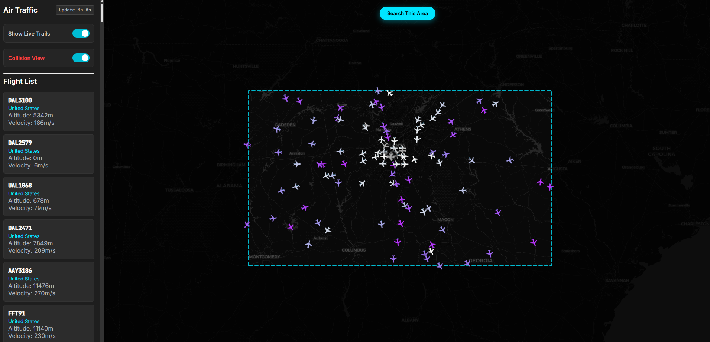

# ✈️ SkyWatch: Real-Time Air Traffic Control & Collision Prevention

[](https://vuejs.org/)
[](https://fastapi.tiangolo.com/)
[](https://www.python.org/)
[](https://leafletjs.com/)

**SkyWatch** is a real-time flight tracking application that visualizes live air traffic data, predicts flight paths using physics-based modeling, and detects potential collisions in real-time.

---

### App Demo


---

## Key Features

- **Real-Time Tracking:** Fetches live flight data from the OpenSky Network API.
- **Predictive Modeling:** Uses **Kalman Filters** to smooth erratic GPS data and predict a plane's position 60 seconds into the future (Ghost Plane visualization).
- **Collision Detection:** Algorithms run continuously to identify aircraft on converging paths, highlighting them in Red/Yellow based on proximity and closure rate.
- **Live Breadcrumbs:** "Tron-style" trails visualize the recent history of flight paths, smoothed to remove API jitter.
- **Region Search:** "Search This Area" feature allows users to query any bounding box on Earth, complete with a spotlight effect for visual focus.
- **Altitude Visualization:** Aircraft are color-coded based on altitude (White for ground/landing, Cyan for climbing, Purple for cruising).
- **Mobile Optimized:** Fully functioning PWA support, allowing native-like installation on iOS and Android with full-screen immersive mode.



---

## Engineering Highlights

### 1. The Jitter Problem & Kalman Filters

Raw API data is often noisy, with planes "teleporting" or freezing between updates. To solve this, I implemented a **Kalman Filter** for each aircraft.

- **State Estimation:** The app maintains a physics state (Position + Velocity) for every plane.
- **Prediction vs. Correction:** Between API updates (every 20s), the app predicts the plane's movement. When new data arrives, it corrects the prediction based on the reliability of the signal.
- **Result:** Smooth, realistic animations at 60fps instead of jumpy static updates.

### 2. Geodetic Coordinate Smoothing

Visualizing rotation on a Mercator projection caused alignment issues at higher latitudes (the "Squashed Map" bug).

- **Solution:** Implemented a **Cosine Correction** algorithm in the rotation logic.
- **Math:** Calculated the flight vector using `Math.atan2(vLng * Math.cos(lat), vLat)` to ensure aircraft icons and prediction lines align perfectly with their true path over the ground.

### 3. Smart History Management

Storing global flight history is resource-prohibitive.

- **Optimization:** Instead of a database, the app uses a "Live Breadcrumb" system stored in browser memory.
- **Smoothing:** Points are only recorded if the aircraft moves >50m, filtering out micro-jitters and creating clean, dotted flight trails.

---

## Tech Stack

- **Frontend:** Vue 3 (Composition API), Leaflet.js (Mapping), CSS3 (Animations)
- **Backend:** Python, FastAPI, Pandas (Data processing), NumPy (Physics calculations)
- **API:** OpenSky Network

---

## How to Run Locally

Because OpenSky's real-time API heavily rate-limits and firewalls cloud datacenter IPs (like AWS or Render), SkyWatch is designed to be run locally. Running the application on your local network bypasses these restrictions and provides uninterrupted access to the live global flight feed.

### Prerequisites

- **Python 3.8+**
- **Node.js 18+**
- An **OpenSky Network** account (Free to create at opensky-network.org)

1. **Clone the Repository**

   ```bash
   git clone [https://github.com/YOUR-USERNAME/Air-Traffic-Control.git](https://github.com/YOUR-USERNAME/Air-Traffic-Control.git)
   cd Air-Traffic-Control

   ```

2. **Backend Setup**

   ```bash
   # Create virtual environment
   python -m venv venv
   source venv/bin/activate  # (or venv\Scripts\activate on Windows)

   # Install dependencies
   pip install -r requirements.txt

   ```

   Create a .env file in the root directory and add your OpenSky credentials:

   ```bash
   OPENSKY_USERNAME=your_username
   OPENSKY_PASSWORD=your_password

   ```

   ```bash
   # Run Server
   uvicorn api:app --reload

   ```

   The backend will now run on http://127.0.0.1:8000

3. **Frontend Setup**
   Open a second terminal window and navigate to the frontend directory:

   ```bash
   cd atc-frontend
   npm install
   npm run dev

   ```

4. **View App**
   Open http://localhost:5173

**Built by Katie Engel**

- [LinkedIn](https://linkedin.com/in/kathleen-engel-gt)
- [GitHub](https://github.com/KatieEngel)
